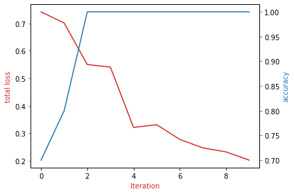

# Hotdog or Not Hotdog

Transform for pretrained model: ResNet18

For more information about resnet18, please check [ResNet18 PyTorch](https://pytorch.org/vision/main/generated/torchvision.models.resnet18.html) website.

Preprocess our dataset by changing the shape of the image, converting to tensor and normalizing the image channels. These are the default preprocessing steps for image data. In addition, we will perform data augmentation on the training dataset. The preprocessing steps for the test dataset is the same, but W do not prform data augmentation on the test dataset. 

    mean = [0.485, 0.456, 0.406]
    
    std = [0.229, 0.224, 0.225]
    
    composed = transforms.Compose([transforms.Resize((224, 224)), transforms.RandomHorizontalFlip(),transforms.RandomRotation(degrees=5) , transforms.ToTensor() , transforms.Normalize(mean, std)])

### Hyperparameters

#### Batch size

    batch_size=32

#### Learning rate

    lr=0.000001
    lr_scheduler=True
	base_lr=0.001
	max_lr=0.01

#### Number of epochs

    n_epochs = 10

#### Momentum

    momentum=0.9

### Plot of Train Cost and Validation Accuracy

     

**It may take a few minutes for the page to open. Please wait to complete your classification process.**

Link to test the classifier model:
https://my-application-6256d4ad85692533c6ebd6e4.mr4ngdkhlwg.eu-gb.codeengine.appdomain.cloud/
